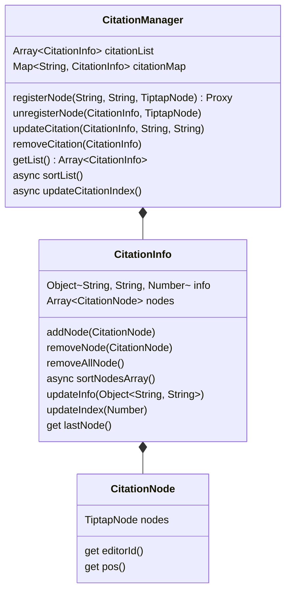
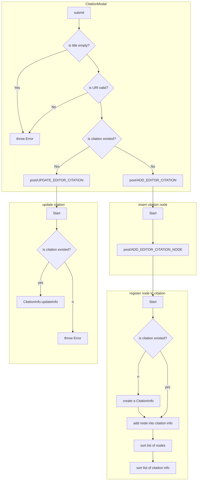
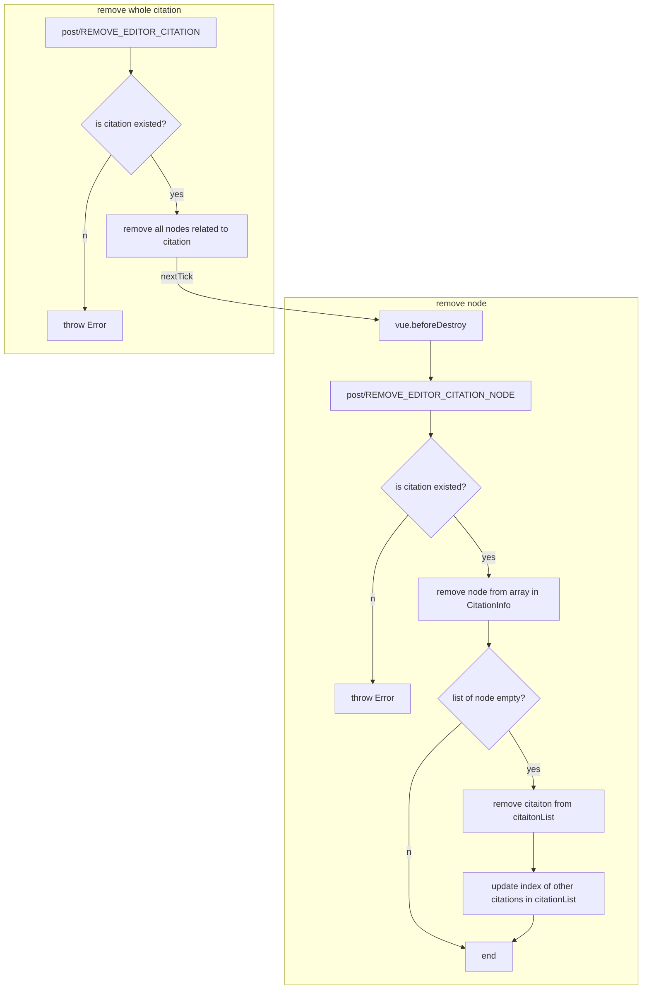

# SYNC Citation System

## Class Diagram

```mermaid

classDiagram
class CitationNode {
TiptapNode nodes
get editorId()
get pos()
}

class CitationInfo {
Object~String, String, Number~ info
Array~CitationNode~ nodes

addNode(CitationNode)
removeNode(CitationNode)
removeAllNode()
async sortNodesArray()
updateInfo(Object~String, String~)
updateIndex(Number)
get lastNode()
}

class CitationManager {
Array~CitationInfo~ citationList
Map~String, CitationInfo~ citationMap

registerNode(String, String, TiptapNode) Proxy
unregisterNode(CitationInfo, TiptapNode)
updateCitation(CitationInfo, String, String)
removeCitation(CitationInfo)
getList() Array~CitationInfo~
async sortList()
async updateCitationIndex()
}

CitationManager *-- CitationInfo
CitationInfo *-- CitationNode

```

## Flow chart

### add new citation

```mermaid
flowchart
subgraph CitationModal
sStartPoint[ submit ]
aThrowError[ throw Error ]
dTitleEmpty{is title empty?}
dURLValid{is URl valid?}
dCitationExisted{ is citation existed?}
aAddCitation[ post/ADD_EDITOR_CITATION ]
aUpdateCitation[ post/UPDATE_EDITOR_CITATION ]

sStartPoint --> dTitleEmpty --> dURLValid
dTitleEmpty -- Yes --> aThrowError
dURLValid -- No --> aThrowError
dURLValid --> dCitationExisted
dCitationExisted -- No --> aAddCitation
dCitationExisted -- Yes --> aUpdateCitation
end

subgraph insert citation node
aInsertCitation[ Start]
aAddNode[ post/ADD_EDITOR_CITATION_NODE ]

aAddCitation --> aInsertCitation
aInsertCitation --> aAddNode
end

subgraph register node to citation
aRegister[ Start ]
dCitationInfoExisted{ is citation existed? }
aNewCitationInfo[ create a CitationInfo]
aAddNodeToCitationInfo[ add node into citation info ]
aSortNodeList[ sort list of nodes]
aSortCitationList[ sort list of citaiton info ]

aAddNode --> aRegister --> dCitationInfoExisted
dCitationInfoExisted --no--> aNewCitationInfo
aNewCitationInfo --> aAddNodeToCitationInfo
dCitationInfoExisted --yes--> aAddNodeToCitationInfo
aAddNodeToCitationInfo --> aSortNodeList --> aSortCitationList
end

subgraph update citation
aUpdate[Start]
dCitationInfoExisted2{ is citation existed? }
aThrowError2[ throw Error ]
aUpdateInfo[ CitationInfo.updateInfo ]

aUpdateCitation --> aUpdate --> dCitationInfoExisted2
dCitationInfoExisted2 --no--> aThrowError2
dCitationInfoExisted2 --yes--> aUpdateInfo
end
```

### remove citaiton

```mermaid
flowchart
subgraph remove node
sStartPoint[vue.beforeDestroy]
sEndPoint[end]
aRemoveNode[post/REMOVE_EDITOR_CITATION_NODE]
dCitationExisted{is citation existed?}
aThrowError[throw Error]
aRemoveFromArray[remove node from array in CitationInfo]
dArrayEmpty{list of node empty?}
aRemoveCitation[remove citaiton from citaitonList]
aUpdateCitationIndex[update index of other citations in citationList]

sStartPoint --> aRemoveNode --> dCitationExisted
dCitationExisted --no--> aThrowError
dCitationExisted --yes--> aRemoveFromArray
aRemoveFromArray --> dArrayEmpty
dArrayEmpty --no--> sEndPoint
dArrayEmpty --yes--> aRemoveCitation --> aUpdateCitationIndex
aUpdateCitationIndex-->sEndPoint
end

subgraph remove whole citation
sRemoveCitation[post/REMOVE_EDITOR_CITATION]
dCitationExisted2{is citation existed?}
aThrowError2[throw Error]
aRemoveAllNode[remove all nodes related to citation]

sRemoveCitation --> dCitationExisted2
dCitationExisted2 --no--> aThrowError2
dCitationExisted2 --yes--> aRemoveAllNode
aRemoveAllNode --nextTick--> sStartPoint
end
```
